# 📊 SEC Filing Analysis System

Multi-Agent RAG System for analyzing SEC filings (10-K, 10-Q, 8-K) with hierarchical retrieval, LangChain agents, and comprehensive evaluation.

## 🎯 Key Features

- **Multi-Agent Architecture**: Manager, Needle, and Summary agents with LLM-based intelligent routing
- **LangChain + LlamaIndex Hybrid**: LangChain for agents, LlamaIndex for advanced retrieval
- **Hierarchical Retrieval**: 3-level auto-merging chunks (256/512/1024 tokens)
- **MapReduce Summary Index**: Section and document-level summaries
- **OpenAI GPT-4o-mini**: Fast, accurate financial analysis
- **LLM-Based Routing**: Dynamic query classification (no hard-coded keywords)
- **Comprehensive Evaluation**: 25 hard tests + 15 LLM tests + 7 human grader tests
- **Financial MCP Tools**: Specialized tools for financial data extraction

## 🏗️ System Architecture

```mermaid
graph TD
    UI[🎨 Streamlit UI<br/>Financial Analysis Chat] -->|User Query| A[👤 User Input]
    A -->|Question| B[🧠 Manager Agent<br/>LLM Classification]
    
    B -->|SUMMARY| C[📋 Summarization Agent<br/>Chief Investment Analyst]
    B -->|NEEDLE| D[🔍 Needle Agent<br/>Senior Financial Analyst]
    B -->|GREETING| G1[👋 Welcome Response]
    B -->|DECLINE| G2[⚠️ No Investment Advice]
    
    C -->|Retrieves from| E[📄 Summary Index<br/>MapReduce Structure<br/>top_k=7]
    D -->|Retrieves from| F[🌳 Hierarchical Index<br/>AutoMerging 256/512/1024<br/>top_k=15-20]
    
    E -->|Stored in| H1[(💾 ChromaDB<br/>financial_summaries)]
    F -->|Stored in| H2[(💾 ChromaDB<br/>financial_hierarchical)]
    
    H1 --> J[📑 SEC Filing<br/>BigBear.ai 10-K]
    H2 --> J
    
    D -->|Enhanced by| K[⚙️ Financial MCP<br/>Amount/Percentage Extraction<br/>Profitability Analysis]
    
    L[📈 Evaluation System<br/>Hard + LLM + Human] -.->|Evaluate| D
    L -.->|Evaluate| C
    
    style UI fill:#667eea,stroke:#333,stroke-width:3px,color:#fff
    style B fill:#fa709a,stroke:#333,stroke-width:3px
    style C fill:#30cfd0,stroke:#333,stroke-width:2px
    style D fill:#30cfd0,stroke:#333,stroke-width:2px
    style K fill:#ffecd2,stroke:#333,stroke-width:2px
    style L fill:#fbc2eb,stroke:#333,stroke-width:2px
```



## 🤖 Agent Architecture

### 🧠 Manager Agent (LLM Router)
- **Role**: Research Director
- **Purpose**: Intelligently routes queries using LLM classification
- **Classification Categories**:
  | Category | Description | Example |
  |----------|-------------|---------|
  | `NEEDLE` | Specific data queries | "What was the revenue?" |
  | `SUMMARY` | High-level analysis | "Give me an overview" |
  | `GREETING` | Introductions | "Hello" |
  | `DECLINE` | Investment advice | "Should I buy?" |
  | `IRRELEVANT` | Off-topic | "What's the weather?" |

```python
# LLM-based classification (no keywords!)
result = classifier_chain.invoke({"query": query})
# Returns: NEEDLE / SUMMARY / GREETING / DECLINE / IRRELEVANT
```

### 🔍 Needle Agent (Precision Data)
- **Role**: Senior Financial Analyst (15+ years experience)
- **Purpose**: Extract precise financial data from SEC filings
- **Specialties**:
  - Exact dollar amounts with $ formatting
  - YoY/QoQ comparisons
  - Profitability metrics (margins, EPS)
  - Risk factors and red flags
  
**Response Format**:
```
**[Direct Answer]**
[Specific answer to the question]

**Key Figures:**
• Revenue: $X.X million (vs $X.X million prior year, +X%)
• Net Income: $X.X million
• Period: FY 2024

**Analysis:**
[Context, drivers, trends]

**Important Notes:**
[Caveats, assumptions]
```

### 📋 Summarization Agent (Executive Analysis)
- **Role**: Chief Investment Analyst
- **Purpose**: Provide executive-level financial summaries
- **Framework**:
  1. 📊 Financial Health Assessment
  2. 🎯 Strategic Positioning
  3. ⚠️ Risk Assessment
  4. 🔮 Forward Outlook

## 📚 Retrieval Architecture

### Hierarchical Index (Needle Agent)
```
Large (1024 tokens, overlap=50)
  └── Medium (512 tokens, overlap=50)
        └── Small (256 tokens, overlap=50)
```

**Why These Sizes?**
- **1024**: Captures full financial sections (MD&A, Risk Factors)
- **512**: Balanced for tables and narratives
- **256**: Precise for specific metrics extraction

**Auto-Merging**: Starts with 256-token chunks, merges to parent when more context needed

### Summary Index (Summarization Agent)
```
MapReduce Structure:
├── Leaf chunks (1024 tokens)
├── Section summaries (every 5 chunks)
└── Document summaries (first 5 chunks)
```

## ⚙️ Financial MCP Tools

| Tool | Purpose |
|------|---------|
| `ExtractAmounts` | Extract and rank dollar amounts |
| `ExtractPercentages` | Growth rates, margins |
| `GetFiscalPeriods` | Q1 2024, FY 2023 identification |
| `AnalyzeProfitability` | Profit vs Loss determination |
| `ExtractRisks` | Risk keyword identification |
| `FinancialHealthCheck` | Comprehensive health score |

## 📊 Evaluation System

### Test Distribution

| Agent | Hard Tests | LLM Tests | Human Tests | Total |
|-------|-----------|-----------|-------------|-------|
| **Needle** | 25 | 15 | 7 | **47** |
| **Summary** | ❌ | 15 | 7 | **22** |
| **Total** | **25** | **30** | **14** | **69** |

### Hard Tests (Needle Agent - 25 tests)
Strict ground truth matching with regex patterns:
- Revenue & Income (5)
- Balance Sheet (5)
- Metrics & Ratios (5)
- Cash Flow (3)
- Business Specifics (4)
- Risk & Compliance (3)

### LLM-as-Judge Tests (30 tests)
LLM evaluates response quality:
```python
Score 0-5:
5 - Excellent: Fully meets criteria with specific, accurate information
4 - Good: Mostly meets criteria with minor gaps
3 - Adequate: Partially meets criteria
2 - Poor: Significant gaps or inaccuracies
1 - Very Poor: Barely addresses the question
0 - Fail: Does not address the question
```

### Human Grader Tests (14 tests)
Complex questions requiring human judgment:
- Financial analysis quality
- Explanation clarity
- Completeness of response

## 🚀 Installation

### Prerequisites
- Python 3.11+
- OpenAI API Key

### Setup

```bash
# Clone repository
git clone https://github.com/your-repo/sec-filing-analyzer
cd sec-filing-analyzer

# Create conda environment
conda create -n sec-analyzer python=3.11 -y
conda activate sec-analyzer

# Install dependencies
pip install -r requirements.txt

# Create .env file
echo "OPENAI_API_KEY=sk-your-key-here" > .env
```

### Run

```bash
# Test system
python test_system.py

# Run Streamlit UI
streamlit run app.py

# Run evaluation
python run_evaluation.py

# Human grading
python human_grader.py
```

## 📁 Project Structure

```
.
├── app.py                          # Streamlit UI
├── test_system.py                  # System verification
├── run_evaluation.py               # Comprehensive evaluation
├── human_grader.py                 # Human grading interface
│
├── agents/
│   ├── manager_agent.py            # LLM-based router
│   ├── needle_agent.py             # Precision financial data
│   ├── summarization_agent.py      # Executive summaries
│   └── cache_agent.py              # Response caching
│
├── core/
│   ├── llm_provider.py             # LangChain ChatOpenAI
│   ├── embeddings.py               # OpenAI Embeddings
│   ├── tokenizer.py                # Token counting (tiktoken)
│   └── system_builder.py           # System orchestrator
│
├── retrieval/
│   ├── hierarchical_retrieval.py   # Auto-merging (256/512/1024)
│   ├── summary_retrieval.py        # MapReduce summaries
│   └── metadata_extractor.py       # SEC filing metadata
│
├── ingestion/
│   ├── indexing.py                 # Index builder
│   ├── chunking.py                 # Hierarchical chunking
│   ├── loader.py                   # PDF loader (pypdf/pdfplumber)
│   └── pdf_downloader.py           # Auto-download SEC filing
│
├── mcp/
│   ├── financial_mcp.py            # MCP orchestrator
│   └── financial_tools.py          # Financial extraction tools
│
├── data/
│   └── corpus.pdf                  # BigBear.ai 10-K filing
│
├── chroma_storage/                 # Vector embeddings
├── docstore_hierarchical/          # Hierarchical nodes
├── docstore_summary/               # Summary nodes
│
├── requirements.txt                # Dependencies
├── .env                            # API keys
└── README.md                       # This file
```

## 🔧 Configuration

### Models
| Component | Model | Purpose |
|-----------|-------|---------|
| LLM | `gpt-4o-mini` | Agent responses |
| Embeddings | `text-embedding-3-small` | Vector search |

### Retrieval Parameters
| Index | top_k | Chunk Sizes |
|-------|-------|-------------|
| Hierarchical | 15-20 | 256/512/1024 |
| Summary | 7 | 1024 (MapReduce) |

## 📈 Example Queries

| Query | Agent | Response Type |
|-------|-------|---------------|
| "What was the total revenue?" | Needle | Exact figure + comparison |
| "Is the company profitable?" | Needle | Profit/Loss analysis |
| "What are the main risk factors?" | Needle | Risk list with details |
| "Give me an executive summary" | Summary | Comprehensive overview |
| "What is the management outlook?" | Summary | Forward-looking analysis |

## ⚠️ Limitations

- **Single Filing**: Analyzes one SEC filing at a time
- **No Real-Time Data**: Based on filed documents only
- **No Investment Advice**: Cannot provide buy/sell recommendations
- **English Only**: Optimized for English SEC filings

## 🔬 Technologies

| Category | Technology |
|----------|------------|
| **Agents** | LangChain |
| **Retrieval** | LlamaIndex |
| **Vector DB** | ChromaDB |
| **LLM** | OpenAI GPT-4o-mini |
| **Embeddings** | OpenAI text-embedding-3-small |
| **UI** | Streamlit |
| **PDF** | pypdf, pdfplumber |

## 📊 Sample Output

**Query**: "What was the total revenue and how did it change?"

**Response**:
```
**Total Revenue**

BigBear.ai reported total revenue of $155.2 million for the fiscal year 
ended December 31, 2024.

**Key Figures:**
• Total Revenue: $155.2 million (FY 2024)
• Prior Year Revenue: $146.1 million (FY 2023)
• Change: +$9.1 million (+6.2% YoY)

**Analysis:**
The revenue increase was primarily driven by growth in the Analytics 
segment, particularly from new government contracts awarded in Q2 2024.
The Cyber & Engineering segment showed stable performance.

**Important Notes:**
- Revenue recognition follows ASC 606
- Includes both product and service revenue
- Government contracts represent ~70% of total revenue
```

---

**Author**: David Kern  
**Course**: GenAI + Agents  
**Date**: January 2025  
**Corpus**: BigBear.ai 10-K Filing (2024)